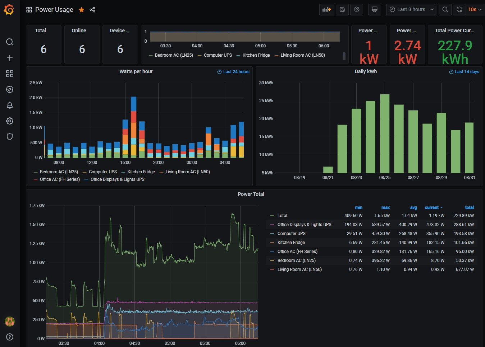

# Power monitor using Grafana and TP-Link HS110 Plugs

This project came to be as I wanted to monitor my appliance power consumption over time; however, this supposedly
easy task was harder than I thought as, until fairly recently, there were no *affordable* reliable high current power
plugs that I could buy. Thankfully, I discovered [TP-Link HS110][3] which were a match made in heaven as their protocol
was reverse engineered meaning I could use mature, open source tools to do the monitoring. To that end, I elected to
use [Grafana][1] which is a nifty little tool that can be used to monitor various signals that come out of your
infrastructure - in my use case, power consumption.

The steps to take to achieve this are the following:

 1. Setup [Grafana][1], [Prometheus][2], and [tp-link exporter][4] as a docker services.
 1. Install a Grafana dashboard which ingests and displays the required metrics.
 1. (Optionally) Configure `ufw` to allow access from the local network.

# Power meter (HS110)

The power meter of choice would be the [TP-Link HS110][3] due to its ability to be used for this purpose using the
exporter provided [here][4]; this was made possible due to the (awesome) reverse engineering of the used protocol,
if you fancy a good read you can read more about this [here][5]. Another, added bonus, is that they are
quite affordable at about 24 € per piece.

## Warning

All power plugs/appliances have power ratings for the maximum amount of Watts and Amperage that they can handle -
please *be careful*. These plugs are quite generous in terms of their allowed wattage as they can handle *up to* 16A of
current and *up to* 3.5kW (at 240V, less than half of that at 110V). This means that they can be used for computers,
servers, UPSes and so on... but not for heavy-duty devices such as stoves, kitchens, high capacity (>24K BTU)
multi-split AC's etc.

# Installation

As detailed below, there are quite a few steps for installation. The following [shell script][7] is designed to
simplify this.

This script includes both **installing** and **updating** as you basically invoke the *same* script with no parameters.

To run it, you can do the following:

```bash
# clone this repository
git clone https://github.com/andylamp/grafana-tp-link
# enter this directory
cd grafana-tp-link
# run the script to install everything
./grafana-tp-link
# alternatively you can use
./grafana-tp-link -i
```

If you need, at some point, to stop the services from running you can run the same script with the parameter `-r`
which stops the services and removes the containers -- and **does** delete the stored data, and their associated
configurations, so be careful!

```bash
# in the same directory as above, execute:
./grafana-tp-link -r
```

## The result

This is what you can expect to see once installed - please note that names, values, and colors might be different in
your case as these are dependent on the names and configuration you give within [Kasa app][10].



# Explanation

## TP-Link exporter container

The first thing we need to configure is the HS110 exporter container, as mentioned previously we'll be using the one
provided from [here][4]. The following `yaml` creates the requested docker service.

```yaml
tp-link-plug-exporter:
  container_name: : tp-link-plug-exporter
  image: fffonion/tplink-plug-exporter:latest
  ports:
    - 9233:9233
  # the service is always restarted unless it is manually stopped.
  restart: unless-stopped
```

## Prometheus container

This is a neat solution for tracking measurements over time, it has much more powerful capabilities than the ones
we're exploiting in this tiny tool. To start a Prometheus container with *persistence* (i.e.: meaning our measurements
will be stored) we can do the following:

```yaml
prometheus:
  container_name: prometheus-local
  image: prom/prometheus:latest
  command:
    - "--storage.tsdb.retention.time=3y"
    - "--web.enable-lifecycle"
    - "--config.file=/etc/prometheus/prometheus.yml"
  user: "1000"
  ports:
    - 9090:9090
  volumes:
    - /usr/prometheus-container-data/config:/etc/prometheus
    - /usr/prometheus-container-data/data:/prometheus
  depends_on:
    - tp-link-plug-exporter
  restart: unless-stopped
```

An interesting point is that the default measurements are not kept for long (due to space constraints).
However, I'd like to keep my data a little longer as space is not really an issue for the volume of data that I am
dealing with, hence by using the flag `--storage.tsdb.retention.time=3y` we tell `Prometheus` to keep the values for
3 years.

Another interesting bit is that we have to explicitly state where the config file resides as when we create the bind
volume for `/etc/prometheus` it's not populated with anything and thus we not only have to copy our configuration file
but also explicitly tell the Prometheus its location.

Finally, please note that in order for everything to work we need to start the container using the ID of the user the
bound volume mounts belong to (in this case, me) - otherwise, it won't work.

## Grafana container

To create and configure our Grafana container, we will use the following `Dockerfile` which creates an image based on
the pre-existing (latest) Grafana version while also setting up bind volumes. This means that we'll also need to create
the appropriate folders on our machine where the data will be stored.

We first start by defining the `yaml` file we want to use - the full dockerfile is shown below.

```yaml
grafana:
  container_name: grafana-local
  image: grafana/grafana:latest
  # here you put your user id that owns the directories - 1000 is an example!
  user: "1000"
  # setup grafana volume mounts for persistence.
  volumes:
    - "/usr/grafana-container-data/data:/var/lib/grafana"
    - "/usr/grafana-container-data/log:/var/log/grafana"
    - "/usr/grafana-container-data/config:/etc/grafana"
  # this is the default port used by Grafana - if you need to use another, change it.
  depends_on:
    - prometheus
  ports:
    - 3000:3000
  # the service is always restarted unless it is manually stopped.
  restart: unless-stopped
```

Please note that this service is dependent on Prometheus (which in turn is dependent on tp-link-exporter).
However, if we want to have the power meter dashboard operational from the get-go we have to perform a little bit
of hacking in order to get everything sorted.

### Registering the datasource (Prometheus)

Initially, in order to use any of the dashboards we have to link Grafana with a datasource, in our case this is our
newly created Prometheus container; hence, exploiting `curl` we can perform the following command to register the
datastore with Grafana:

```bash
# wrapper function that sets up the prometheus data source and sets it as the default one.
function setup_prometheus_datasource() {
  # now, since the endpoint seems alright - try to use the username/pass to access the API
  req_status=$(curl -s -I --user ${GRAF_USER}:${GRAF_PASS} ${GRAF_API_DATASOURCES} 2>/dev/null | \
head -n 1 | cut -d$' ' -f2)
  # check the return code of the API - if it is 200, then we can login and register the datasource.
  if [[ "${req_status}" -ne "200" ]]; then
    cli_error "The HTTP request code returned was not 200 but rather ${req_status}, indicating an error"
    return 1
  else
    cli_info "Grafana API is accessible and can use the supplied credentials to interact."
    if curl -s --user ${GRAF_USER}:${GRAF_PASS} ${GRAF_API_DATASOURCES} | grep -q "prometheus"; then
      cli_warning "Seems Prometheus datasource is already present - skipping grafana config."
    else
      cli_info "Prometheus data source seems to be missing -- registering"
      req_status=$(curl -s --user ${GRAF_USER}:${GRAF_PASS} ${GRAF_API_DATASOURCES}/ \
-X POST -H "${CONT_TYPE}" \
--data-binary "{\"name\":\"Prometheus\", \"isDefault\":true , \
\"type\":\"prometheus\", \"url\":\"http://${HOST_PROM}:9090\", \"access\":\"proxy\", \"basicAuth\":false}")

       # now check if the data source was added
      if echo "${req_status}" | grep -q "Datasource added"; then
        cli_info "Prometheus data source appears to have been added successfully."
      else
        cli_error "Could not add Prometheus data source, reason: ${req_status}."
        return 1
      fi
    fi
  fi
}
```

This function tries to register the datasource while also checking if we failed or if the datasource we are trying to
add (`Prometheus`) is already registered.

### Registering the Dashboard

The next thing we need to perform is to register the power consumption monitor dashboard into our newly Grafana
container; to do so, we'll exploit the provided [REST API][9].

To register the dashboard (full `json` dashboard definition can be found [here][6]) - we have to perform the
following command:

```bash
# try to register the grafana dashboard based on the json spec
req_status=$(curl -s --user ${GRAF_USER}:${GRAF_PASS} -X POST "${GRAF_API_DASHBOARDS}/db" \
-H "${CONT_TYPE}" --data-binary "$(cat < ${GRAF_DASH_FILE})")

# check if the registration was successful
if [[ "$(echo "${req_status}" | jq -r '.status')" == "success" ]]; then
  cli_info "Grafana dashboard was registered successfully!"
elif [[ "$(echo "${req_status}" | jq -r '.status')" == "name-exists" ]]; then
  cli_warning "Grafana dashboard with the same name already exists - skipping registration"
else
  cli_error "Could not register grafana dashboard... something went wrong -- cannot continue"
  return 1
fi
```

### Starring the Dashboard

Following the registration of our dashboard before being able to set it as the default for our current user we have
to `star` is, which can be performed as is shown below:

```bash
# now, star the dashboard which was just registered for our user
req_status=$(curl -s --user ${GRAF_USER}:${GRAF_PASS} \
-X POST ${GRAF_API_BASE}/user/stars/dashboard/"${dash_id}"/ \
-H "${CONT_TYPE}")

# check if the dashboard has been already starred or if the process was succesful or not
if [[ "${dash_starred}" = "true" ]]; then
  cli_warning "Dashboard already starred - skipping"
elif echo "${req_status}" | grep -q "Dashboard starred!"; then
  cli_info "Dashboard with uid: ${dash_uid} was starred successfully for user ${GRAF_USER}"
else
  cli_error "Dashboard with uid: ${dash_uid} failed to be starred for user ${GRAF_USER} -- cannot continue"
  return 1
fi
```

### Making the Dashboard default

The final bit of the long puzzle is to make the newly created dashboard the default one, meaning that when logging
in the first thing presented would be this dashboard.

```bash
# finally, we have to make it the default dashboard, so once we login is immediately presented
req_status=$(curl -s --user ${GRAF_USER}:${GRAF_PASS} -X PUT "${GRAF_API_BASE}/user/preferences" \
-H "${CONT_TYPE}" \
--data-binary "{\"homeDashboardId\": ${dash_id}, \"theme\": \"\", \"timezone\": \"\"}")

if echo "${req_status}" | grep -q "Preferences updated"; then
  cli_info "User ${GRAF_USER} preferences updated to make dashboard (with id: ${dash_id}) default"
else
  cli_error "Error updating user preferences to make dashboard (with id: ${dash_id}) default"
  return 1
fi
```

### Extra bits

The scripts that were used to experiment with the Grafana API are included as scratch notes [here][8] hopping that
might be of use to somebody; use them at your own peril!

## (Optionally) configure `ufw`

In order to be able to access the Grafana dashboard through our wider local network then we'd need to configure our
firewall to allow these ports for outside communication; in my case, I am mostly using `ufw`, so if your firewall
differs please follow its respective manual to open the required ports.

There are different ways to configure the ports but personally the way I like to do this is to create individual rules
in `ufw` for each application I want to allow/block and just apply them - this is also a bit tidier in case you want to
see what's going on when using `ufw status verbose`. An example of a rule for `Grafana` is the following:

```text
[grafana]
title=Grafana
description=Grafana
ports=3000/tcp
```

The rules are normally placed in `/etc/ufw/applications.d/`, which is where I've put this as well. Please note that
they *do not* require any type of extension; for example the above rule would be placed using:

```bash
sudo echo -e \
"[grafana]
title=Grafana
description=Grafana
ports=3000/tcp
" > /etc/ufw/applications.d/grafana
```

Now to register, we could use the following segment, which both checks if the rule is already registered and reports
any failures.

```bash
setup_ufw() {
  # optionally, we can configure ufw to open grafana to our local network.
  if [[ ${UFW_CONF} = true ]]; then
    cli_info "Configuring ufw firewall is enabled - proceeding"
    # output the rule in the ufw application folder - note if rule already exists, skips creation.
    if [[ -f /etc/ufw/applications.d/${UFW_GRAF_RULENAME} ]]; then
      cli_warning "ufw Grafana rule file already exists - skipping."
    else
        if ! echo -e \
"[${UFW_GRAF_RULENAME}]
title=Grafana
description=Grafana
ports=3000/tcp
" | sudo tee -a /etc/ufw/applications.d/${UFW_GRAF_RULENAME} > /dev/null; then
        cli_error "Failed to output Grafana ufw rule successfully - exiting."
        return 1
      else
        cli_info "ufw Grafana rule file was created successfully!"
      fi
    fi

    # now configure the ufw rule
    if [[ "$(sudo ufw status)" == "Status: inactive" ]]; then
      cli_warning "ufw is inactive we are not adding the rule in it for now."
    elif ! sudo ufw status verbose | grep -q ${UFW_GRAF_RULENAME}; then
      cli_info "ufw rule seems to be missing - trying to add!"
      if ! sudo ufw allow from ${UFW_SUBNET} to any app ${UFW_GRAF_RULENAME}; then
        cli_error "Failed to configure ufw rule - exiting!"
        return 1
      else
        cli_info "ufw Grafana rule was applied successfully!"
      fi
    else
      cli_warning "ufw Grafana rule seems to be registered already - skipping!"
    fi
  fi
}
```

[1]: https://grafana.com/
[2]: https://prometheus.io/
[3]: https://www.tp-link.com/gr/home-networking/smart-plug/hs110/
[4]: https://github.com/fffonion/tplink-plug-exporter
[5]: https://github.com/softScheck/tplink-smartplug
[6]: dash.json
[7]: grafana-tp-link-docker
[8]: scratch-scripts
[9]: https://grafana.com/docs/grafana/latest/http_api/
[10]: https://www.kasasmart.com/us
