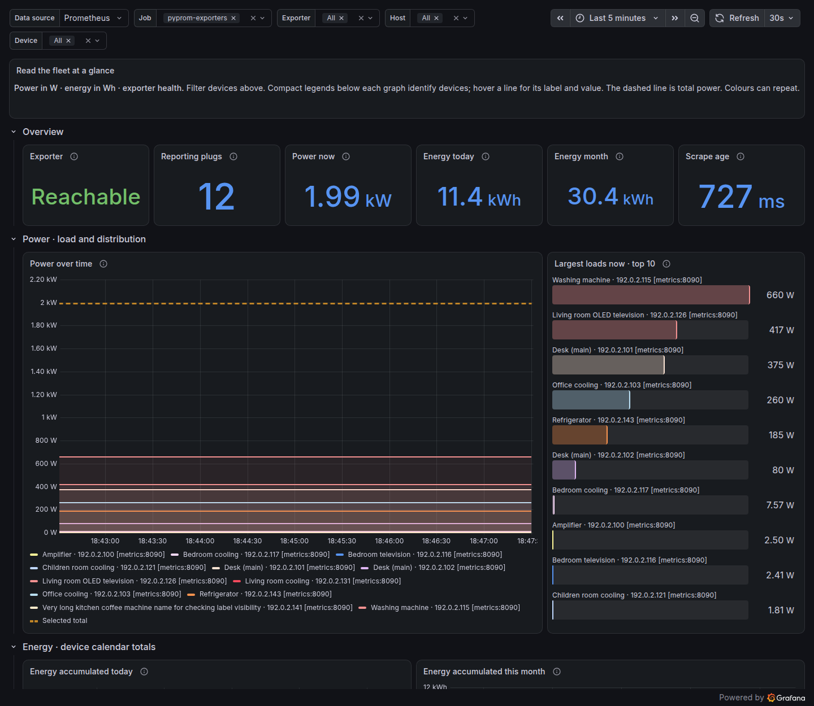

# TP-Link power monitoring

Monitor TP-Link Tapo and Kasa energy-monitoring plugs with
[pyprom-exporters](https://github.com/andylamp/pyprom-exporters), Prometheus and Grafana.
The stack provisions its datasource, dashboard and alert rules from this repository.
It probes devices on scrape by default and keeps monitoring data in persistent Docker volumes.

**Already running the older stack?** Read [Migrating an existing installation](docs/migration.md)
before starting these containers. The new stack uses fresh volumes by default and does not migrate old databases.

## What is included

| Component | Pinned version | Purpose |
| --- | --- | --- |
| pyprom-exporters | 0.2.0 | Concurrent Tapo/Kasa discovery and live measurements |
| Prometheus | 3.15.0 | Time-series storage, scraping and alert evaluation |
| Grafana | 13.2.2 | Provisioned power, energy and health dashboard |

Images are pinned by version and digest in [compose.yaml](compose.yaml). The exporter replaces
`fffonion/tplink-plug-exporter`; its metrics and device configuration are different.

The dashboard includes current power, daily/monthly energy, voltage, current, Wi-Fi signal and exporter diagnostics.
Only Grafana's built-in panels are used. Datasource, job, exporter, host and device filters make it portable across
installations, including devices with identical aliases.



## Quick start

Install [uv](https://docs.astral.sh/uv/getting-started/installation/) and
[Docker with the Compose plugin](https://docs.docker.com/compose/install/).
The Python utility supports Python 3.11 and newer; uv can provision Python when needed.
The Docker host must be able to reach your plugs on the LAN.

```sh
git clone https://github.com/andylamp/grafana-tp-link.git
cd grafana-tp-link
uv sync --locked
uv run --locked power-monitor init
```

`init` creates a Git-ignored `.env` with private permissions and a randomly generated Grafana admin password.
It prints no password and preserves an existing `.env`.

Edit the existing `exporter.exporters.tapo.devices` list in [config/stack.yaml](config/stack.yaml),
keeping the file's other settings. Add one plug IP address or resolvable hostname per entry, with comments as needed:

```yaml
exporter:
  exporters:
    tapo:
      devices:
        - "192.0.2.10" # Desk plug; replace this example address.
        - "kitchen-plug.example" # Kitchen plug; replace this example hostname.
```

Use your own reachable addresses and reserve their DHCP addresses where possible.
Docker bridge networking does not provide reliable LAN broadcast discovery.
The comments describe your inventory; dashboard aliases still come from the plugs themselves.

Edit `.env` for credentials:

- Set `TP_LINK_USERNAME` and `TP_LINK_PASSWORD` when your devices require Tapo account authentication.
  Older Kasa/HS110 devices may work with both empty.
- Keep or change the generated `GRAFANA_ADMIN_PASSWORD`. Read it locally from `.env` when signing in.
  Single-quote values containing `$` or `#` so Compose treats those characters literally.

If you already have an exporter-only `.env`, also add a nonempty `GRAFANA_ADMIN_PASSWORD` for the stack.
`init` preserves existing files and does not fill in missing credentials. Both `check` and `up` require this value;
an empty `GRAFANA_ADMIN_PASSWORD` in your shell overrides a value in `.env`, so unset an unintended shell override.

Then validate and start the stack:

```sh
uv run --locked power-monitor check
uv run --locked power-monitor up
```

Open Grafana using `grafana.bind_address` and `grafana.port` from `config/stack.yaml`
(`http://localhost:3333/` with the checked-in configuration),
and sign in as `admin`, or your configured `GRAFANA_ADMIN_USER`.
The **TP-Link · Power & Energy** dashboard is provisioned automatically and selected as the home dashboard.
No API registration script, manual datasource creation or dashboard upload is required.

`check` validates the effective YAML and environment settings, generates native service configuration, and runs
the pinned Prometheus image's `promtool` against the configuration and alert-rule fixtures.
It does not start the exporter or probe plugs.
`up` waits for container health checks; those checks establish service readiness,
not that every configured plug has produced a reading.

Both commands show progress through configuration loading and validation, along with the effective device count,
live/polling mode, and Prometheus scrape interval and timeout. `check` also identifies each Prometheus validation step.
After a successful `up`, the utility reports service health, Grafana's home/dashboard URLs, and commands for status/logs.
URLs use Docker's actual published ports, including ports changed or assigned dynamically through Compose overrides.
Prometheus and exporter links appear when their HTTP ports are published; otherwise they are identified as internal
services. The default stack publishes only Grafana. With a remote Docker context, these addresses belong to the Docker
host; use that host or an SSH tunnel to reach them.
Startup failures retain Docker's exit status and print diagnostic commands instead of a success summary.
Credentials are not included in the progress messages or summary.

## Operating the stack

Run commands from this checkout. From another directory, specify both the uv project and stack location:

```sh
uv run --locked --project /path/to/grafana-tp-link \
  power-monitor --directory /path/to/grafana-tp-link status
```

| Command | Behavior |
| --- | --- |
| `uv run --locked power-monitor init` | Create `.env` once without replacing local settings |
| `uv run --locked power-monitor check` | Validate Compose, Prometheus configuration and rules |
| `uv run --locked power-monitor up` | Create/update services and wait for health checks |
| `uv run --locked power-monitor status` | Show service status |
| `uv run --locked power-monitor logs --follow exporter` | Follow exporter logs |
| `uv run --locked power-monitor down` | Stop this stack while retaining persistent volumes |
| `uv run --locked power-monitor reset --yes` | Delete this project's containers and data volumes |
| `uv run --locked power-monitor pull` | Download the pinned images |

`make init`, `make up`, `make down`, `make status`, `make logs` and `make pull` provide equivalent shortcuts.
The compatibility wrapper `./grafana-tp-link-docker -i` starts services and `-r` stops them while preserving data.
Use `power-monitor init` first. The wrapper's old destructive removal behavior has been removed;
deleting monitoring data now requires the explicit reset command below.

The Compose project is `tp-link-monitoring`, distinct from the legacy `grafana-tp-link` project.
`status`, `logs`, `down`, `reset --yes` and `pull` also work without `.env` or a valid `config/stack.yaml`.
If you originally set a custom
`COMPOSE_PROJECT_NAME`, retain that name in `.env` or export it in your shell to address the same stack.
`check` and `up` read the YAML and effective environment and require at least one explicit device host
before creating containers.
For a deployment with additional Compose files, pass each one before the command, in the same order every time:

```sh
uv run --locked power-monitor --compose-file compose.override.yaml up
uv run --locked power-monitor --compose-file compose.override.yaml down
```

Paths are relative to the checkout; repeat `--compose-file` for additional files. The utility loads the base
`compose.yaml`, then generated storage settings for `check`/`up`, then explicit overrides in the supplied order.
Retain override options for `check`, `status`, `logs`, `reset` and other lifecycle commands too.

Pulling downloads the versions recorded in `compose.yaml`; it does not select newer releases automatically.
Review version and digest changes together, consult upstream upgrade notes, back up data, then run `pull` and `up`.

### Reset for a fresh run

**For managed Docker volumes, reset deletes Prometheus history and Grafana's stored accounts and settings.**
Use it when you intend to discard this stack's persistent data, such as during local iteration:

```sh
uv run --locked power-monitor reset --yes
uv run --locked power-monitor up
```

The equivalent Makefile shortcut supplies the required confirmation flag for you:

```sh
make reset && make up
```

`reset` requires `--yes` and has no interactive prompt; without that flag it refuses to proceed.
It runs `docker compose down --volumes --remove-orphans` for the selected Compose project, removing its containers
(including orphaned services), non-external networks, declared named volumes and attached anonymous volumes.
It does not run a global Docker prune or restart services automatically.

Your `.env`, tracked configuration, source files and downloaded images remain in place.
External volumes and host bind-mounted directories are retained. With the standard named-volume configuration,
the next `up` creates empty storage and provisions the checked-in dashboard and datasource again, using the admin
credentials retained in `.env`. A deployment using bind-mounted data keeps that data; reset does not erase its host files.

Reset also works if `.env` is missing. Preserve or export a custom `COMPOSE_PROJECT_NAME` to select the intended project;
without that setting, the default project is selected. Recreate/configure `.env` before starting services again if needed.
For an ordinary stop that retains monitoring data, use `down` or the wrapper's `-r` instead.

## Configuration

[config/stack.yaml](config/stack.yaml) is the single user-facing file for device inventory, exporter behavior,
Grafana's address/port, both services' storage locations, Prometheus retention, and scrape/evaluation intervals.
Credentials stay in the private `.env`.
Edit the existing YAML values and keep comments next to settings or individual device hosts.

| YAML setting | Checked-in value | Meaning |
| --- | --- | --- |
| `grafana.bind_address` | `localhost` | Host address serving Grafana; normalized to `127.0.0.1` |
| `grafana.port` | `3333` | Host port serving Grafana |
| `grafana.data_directory` | `null` | Docker volume; set a host directory to use a bind mount |
| `prometheus.data_directory` | `null` | Docker volume; set a host directory to use a bind mount |
| `prometheus.retention_time` | `3y` | Maximum stored history by age |
| `prometheus.retention_size` | `10GB` | Maximum stored blocks by size |
| `prometheus.scrape_interval` | `30s` | Time between exporter scrapes |
| `prometheus.scrape_timeout` | `25s` | Maximum wait for one exporter scrape |
| `prometheus.evaluation_interval` | `30s` | Time between alert evaluations |
| `exporter.prometheus_port` | `8090` | Exporter's internal metrics port |
| `exporter.log_level` | `INFO` | Exporter logging level |
| `exporter.exporters.tapo.devices` | Empty list | One explicit plug IP or hostname per entry |

The `exporter` section contains the exporter's native configuration, including device concurrency, discovery options,
live-refresh settings and metric definitions. It is nested under `exporter` so the service settings remain in one file.
The utility validates shared settings and common device options.
The exporter validates advanced native options at startup.
Do not put account credentials in YAML.

| `.env` credential | Default | Meaning |
| --- | --- | --- |
| `TP_LINK_USERNAME`, `TP_LINK_PASSWORD` | Empty | Device account credentials when required |
| `GRAFANA_ADMIN_USER` | `admin` | Initial Grafana administrator name |
| `GRAFANA_ADMIN_PASSWORD` | Generated by `init` | Initial password for a new Grafana database |

Changing Grafana's initial admin settings does not reset accounts in an existing database.
Use Grafana's account-management or password-reset facilities for an existing installation.
Docker administrators can inspect container environment variables; keep `.env` private.

`check` and `up` generate read-only native service files under ignored `.runtime/<digest>/`.
The utility does not rewrite the selected YAML, so inline comments and formatting survive.
Generated files contain no account credentials and should not be edited or committed.
The tracked Prometheus and Grafana provisioning files are implementation templates; ordinary configuration changes
belong in `config/stack.yaml`. The renderer keeps the exporter target and Grafana datasource interval aligned.

After changing YAML or credentials, use:

```sh
uv run --locked power-monitor check
uv run --locked power-monitor up
```

Changes to generated service files produce different mount paths; port and retention changes update the Compose model.
`up` recreates affected service containers while retaining their data volumes. No manual restart is needed.
Use these utility commands to prepare configuration before starting services; a raw `docker compose up` skips that
preparation. Include your `--compose-file` options when using local overrides.

Grafana binds to the local host by default; `localhost` is normalized to `127.0.0.1`. For remote access, configure a
suitable bind address and your network's access controls, or place it behind an authenticated TLS reverse proxy.
Prometheus and the exporter are available only on the Compose network; their ports are not published to the host.

Prometheus removes older blocks when either retention limit is reached. The size setting does not cap all disk use:
allow additional space for the write-ahead log, active samples and compaction. Volumes persist across `down` and `up`.
Use the explicit reset command only when you intend to discard that data.

### Selecting a configuration

The default is `config/stack.yaml`. For custom configurations, keep complete YAML copies in `scratch/configs/`.
The entire `scratch/` directory is excluded by both `.gitignore` and `.dockerignore`, keeping local profiles
out of commits and Docker build contexts.
From the repository root, create a profile:

```sh
mkdir -p scratch/configs
cp config/stack.yaml scratch/configs/home.yaml
```

Edit `scratch/configs/home.yaml` to configure your device hosts, storage directories, ports and scrape settings.
Keep its `grafana`, `prometheus` and `exporter` sections; inline comments can describe local settings and devices.
Credentials remain in the checkout's `.env` or shell environment. If `.env` does not exist yet, run
`uv run --locked power-monitor init` and configure credentials as described in [Quick start](#quick-start).

Validate and start using the global `--config` option before the command:

```sh
uv run --locked power-monitor --config scratch/configs/home.yaml check
uv run --locked power-monitor --config scratch/configs/home.yaml up
```

Create additional copies such as `scratch/configs/lab.yaml` as needed, and pass the chosen file explicitly each time.
Profiles are not discovered automatically. Supported nonempty environment overrides still take precedence over
profile values; remove old overrides when you want the YAML values to apply.
For a single local configuration, `config.local.yaml` in the repository root is also Git-ignored and can be selected
with `--config config.local.yaml`.

Relative configuration paths are resolved against the checkout selected by `--directory`, not the shell's current directory.
Absolute paths also work. Only the selected YAML is loaded; missing or invalid selections never fall back to the default.
Use the same selection for subsequent `check` and `up` commands. Credentials still come from that checkout's `.env` or shell.
The ignored generated configurations remain under that checkout's `.runtime/`.
Relative storage paths also use the checkout root: `./data/grafana` means `<checkout>/data/grafana` even for a profile
in `scratch/configs/`.

The old `config/exporter.yaml` has been consolidated into the stack YAML's `exporter` section.
Its native settings are preserved when generating the configuration mounted inside the exporter container.
A native exporter-only YAML is not a complete stack configuration; put its contents under `exporter` alongside `grafana`
and `prometheus`. The utility never implicitly reads or merges a leftover `config/exporter.yaml`.

Selecting another YAML changes settings for the same Compose project; it does not create an isolated deployment.
Use distinct `COMPOSE_PROJECT_NAME` values and distinct storage when running independent deployments.
Recovery commands can accept `--config` but do not read it, so broken or missing YAML cannot block stopping the project.

### Storage locations

Set `grafana.data_directory` and `prometheus.data_directory` in the selected YAML. With `null` (the default), Docker
manages the existing `grafana-data` and `prometheus-data` volumes. No data is moved by adding these settings.
To use host directories, edit these fields in the existing sections while retaining their other settings:

```yaml
grafana:
  data_directory: ./data/grafana
prometheus:
  data_directory: ./data/prometheus
```

Relative data paths are resolved against the checkout, including when the selected YAML is elsewhere. Absolute paths
also work. The containers keep their native paths: Grafana writes to `/var/lib/grafana` and Prometheus to `/prometheus`.
Create the host directories on the Docker host and make them writable by the respective container users before starting.
The utility never creates, changes ownership of, copies or deletes host data directories; missing bind directories make
startup fail instead of creating empty storage. `check` runs Prometheus validation, but does not test Grafana's storage
permissions or start Grafana.

Apply changes with `power-monitor --config config.local.yaml check` and `power-monitor --config config.local.yaml up`
(or omit `--config` for the default file). Storage selection is generated from YAML; no Compose override is needed.
Changing a directory selects a different store and does not migrate the previous data. Follow the
[migration guide](docs/migration.md) when retaining an existing installation.
`reset --yes` removes this project's managed Docker volumes but retains host directories and their contents.

### Optional environment overrides

[.env.example](.env.example) keeps noncredential overrides commented out. YAML is sufficient for normal operation.
Compose resolves shell values ahead of `.env`; a nonempty resolved override replaces its corresponding YAML value.
An empty or unset override uses YAML. Remove or unset an old override when you want YAML edits to take effect.

| Environment override | YAML setting |
| --- | --- |
| `TAPO_PLUG_DEVICES` | `exporter.exporters.tapo.devices` |
| `PYPROM_EXPORTERS_LOG_LEVEL` | `exporter.log_level` |
| `GRAFANA_BIND_ADDRESS`, `GRAFANA_PORT` | `grafana.bind_address`, `grafana.port` |
| `GRAFANA_DATA_DIRECTORY` | `grafana.data_directory` |
| `PROMETHEUS_DATA_DIRECTORY` | `prometheus.data_directory` |
| `PROMETHEUS_RETENTION_TIME`, `PROMETHEUS_RETENTION_SIZE` | `prometheus.retention_time`, `prometheus.retention_size` |
| `PROMETHEUS_PORT` | `exporter.prometheus_port` |
| `PROMETHEUS_SCRAPE_INTERVAL` | `prometheus.scrape_interval` |
| `PROMETHEUS_SCRAPE_TIMEOUT` | `prometheus.scrape_timeout` |
| `PROMETHEUS_EVALUATION_INTERVAL` | `prometheus.evaluation_interval` |

A nonempty `TAPO_PLUG_DEVICES` replaces the entire YAML device list, with hosts separated by spaces or commas.
Whitespace/comma-only lists are invalid. Each YAML list item is one IP address or hostname; descriptions belong after `#`.
The effective configuration must contain at least one explicit host because broadcast discovery is disabled.
For example, clear any old device override in `.env` and run `unset TAPO_PLUG_DEVICES` in your shell before using YAML.

### Scraping and device concurrency

The defaults scrape the exporter every 30 seconds with a 25-second Prometheus timeout.
Under `exporter.exporters.tapo`:

- `prometheus_options.refresh_interval: null` probes on scrape.
- `prometheus_options.scrape_timeout: 20.0` caps how long a scrape waits for the refresh.
- `max_concurrent_devices: 10` bounds concurrent device operations.
- `discovery_options.timeout: 5` sets the individual device request timeout in seconds.

Keep the exporter wait below Prometheus's scrape timeout, and the scrape timeout at or below the scrape interval.
A positive `refresh_interval` enables background polling instead of live probing. Adjust concurrency or polling intervals
based on observed device latency and LAN capacity; larger fleets and unreachable plugs can lengthen refreshes.
Overlapping scrapes share an in-flight refresh. If its wait expires, the exporter can return an older snapshot.
Validate and apply any changes using `power-monitor check` and `power-monitor up`.

## Reading and reusing the dashboard

[dash.json](dash.json) is a standalone dashboard that can also be imported into another Grafana installation.
Choose **Dashboards → New → Import**, upload the file, and select a Prometheus source using the dashboard's
**Data source** variable. The provisioned source has UID `prometheus`; the dashboard UID is `tp-link-power`.
Choose the job and exporter filters if your scrape labels differ. Source details stay in these filters instead of
repeating in device labels. Select a single job and exporter when different installations reuse device host addresses.

Compact legends sit below each graph, leaving its full width available for readings. Legend entries flow into multiple
columns when space permits; Grafana's native legend does not enforce a fixed column count. Panels provide room for a
twelve-device fleet without internal vertical scrolling. Use the Host and Device filters to focus larger selections.
Hover a graph to see its device labels and values, or click a legend entry to focus a series.

Every device label uses **alias · host**, without a bracketed suffix. The host distinguishes plugs with identical aliases.
Colors follow this name across graphs and ranked readings, even when ranking or filters change. Grafana's finite palette
can reuse a color, so use the label to identify a device. The selected power total is a separate dashed, amber line.

Current-load and Wi-Fi panels retain labels beside each reading, including when only one device is selected. Wi-Fi rows
put the weakest signal first; values closer to zero are stronger. Their colors identify devices, matching the graphs,
rather than classifying signal quality.

The provisioned dashboard is managed by its JSON file. Save customizations back to `dash.json`, or make a separate
Grafana copy with a different UID. Provisioning updates the managed dashboard from disk; UI changes are disabled for it.

| Metric | Native unit | Dashboard meaning |
| --- | --- | --- |
| `current_consumption` | W | Instantaneous device power |
| `current_voltage` | V | Device voltage, where supported |
| `current_current` | A | Device current, where supported |
| `current_rssi` | dBm | Received wireless signal strength, where supported |
| `current_consumption_today` | Wh | Energy accumulated on the plug's calendar day |
| `current_month_consumption` | Wh | Energy accumulated in the plug's calendar month |
| `tapo_discovered_devices` | Devices | Retained discovery inventory, not an online count |

Energy is already in Wh; Grafana scales its display to kWh when appropriate. Daily and monthly values are gauges that
reset on the plug's calendar. They are neither lifetime counters nor energy consumed during the dashboard's selected
range. The dashboard does not apply `rate`/`increase` to them or estimate energy from a fixed sampling cadence.

A blank reading means unavailable data, not zero. Totals include only selected devices that report the relevant metric.
The same physical plug monitored by multiple exporters can be counted more than once. Model and firmware capabilities
vary, so a working power reading does not imply that voltage, current, energy or Wi-Fi metrics are available.

**Exporter scrape status and scrape age describe Prometheus requests, not device freshness.** The exporter does not expose
per-device update timestamps, online status or relay state. A successful scrape can contain an older snapshot; inspect
exporter logs when values stop changing. Graphs preserve gaps, and queries hide device values when the exporter scrape
has failed.

### Alerts and troubleshooting

[prometheus/alerts.yml](prometheus/alerts.yml) evaluates three rules:

| Alert | Condition |
| --- | --- |
| `TapoExporterDown` | An exporter target fails scrapes for two minutes |
| `TapoNoPowerReadings` | A reachable exporter returns no power series for five minutes |
| `TapoPlugReadingsMissing` | A host seen within 24 hours has no current power series for five minutes |

These rules are evaluated in Prometheus. No Alertmanager or notification delivery is configured.
The missing-host rule cannot detect a plug that has never reported, or one absent for longer than its 24-hour history
window. Intentionally removing a previously observed host can trigger it. None of these rules can detect an old snapshot
that is still being returned successfully.

For missing readings, check `power-monitor status`, then `power-monitor logs exporter`.
Confirm the YAML hosts and any active `TAPO_PLUG_DEVICES` override, reachability from Docker, credentials
and the device's energy-monitoring support.
If Grafana cannot query Prometheus, inspect `power-monitor logs prometheus grafana` and datasource provisioning.

## Development

```sh
uv sync --locked
uv run --locked prek install
uv run --locked pytest
uv run --locked prek run --all-files
```

Pytest runs with up to four workers by default; use `-n 0` for serial debugging.

For VS Code, run `uv sync --locked` and install the [workspace extension recommendations](.vscode/extensions.json).
The workspace defaults to `.venv`; if you already selected another interpreter, use **Python: Select Interpreter**
to choose this checkout's environment. Ruff and ty use the environment's tools and the project's configuration;
Markdown uses the shared markdownlint configuration, and JSON uses VS Code's built-in formatter.
Normal Test Explorer runs retain parallel execution. **Debug Test** uses the checked-in launch configuration
with `-n 0` so breakpoints work in one process.
Editor terminals do not automatically import deployment `.env` values, avoiding stale shell overrides after file edits.
The CLI still loads `.env`; Python test/debug environment loading remains controlled separately by `python.envFile`.

Docker integration tests are skipped unless explicitly enabled. To run them against the pinned images:

```sh
make integration
# Equivalent:
RUN_STACK_INTEGRATION=1 uv run --locked pytest -n 0 -m integration
```

The integration suite uses an isolated Compose project and fake devices/metrics. It does not require physical plugs
or real account credentials. It validates configuration, provisioning, dashboard queries and monitoring failure cases.
`make test` runs the regular tests; `make check` runs all prek hooks.

Ruff enables all stable and preview rules, ty checks Python, and Markdown uses the same
[markdownlint configuration](.markdownlint-cli2.jsonc) as `pyprom-exporters`.
Python dependencies and tools are locked in `uv.lock`; update them with `uv lock --upgrade`, then rerun checks.
Keep audit notes in ignored `scratch/` and generated reports in ignored `report/`.

The **Code quality and tests** GitHub Actions workflow runs on pushes to every branch and on pull requests.
Lint/format/type checks, Python 3.11–3.14 tests and package builds, and Docker integration tests run as parallel jobs.

[Dependabot](.github/dependabot.yml) checks weekly and combines Python dependencies (including transitive dependencies),
GitHub Actions, Compose images and prek hooks into one version-update PR, with at most one such PR open at a time.
Security updates are grouped separately for Python and GitHub Actions, the ecosystems here that support them.
[GitHub cannot combine security updates across ecosystems or with version updates](https://docs.github.com/en/code-security/concepts/supply-chain-security/dependabot-security-updates#about-grouped-security-updates),
so security fixes may produce additional PRs. The version-update limit does not delay security updates.
Dependabot configuration takes effect after it reaches the default branch.

## Repository layout

- `compose.yaml`: pinned Compose services, volumes and health checks.
- `config/stack.yaml`: all noncredential user settings, including device inventory.
- `prometheus/`: native configuration templates, alert rules and rule fixtures.
- `grafana/provisioning/`: native datasource and dashboard provisioning templates.
- `.runtime/`: ignored generated native service configuration; do not edit it.
- `dash.json`: portable Grafana dashboard.
- `src/grafana_tp_link/`: the `power-monitor` utility.
- `tests/`: configuration, dashboard, utility and isolated integration tests.
- `docs/migration.md`: preservation and upgrade guidance for an existing stack.
